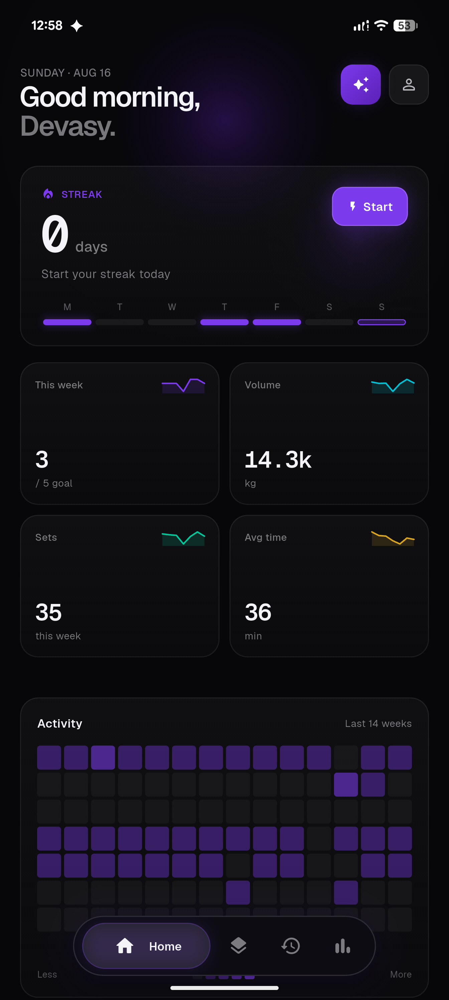
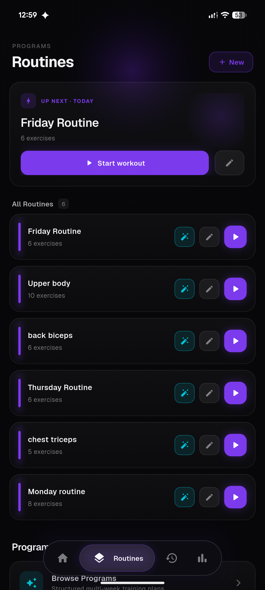
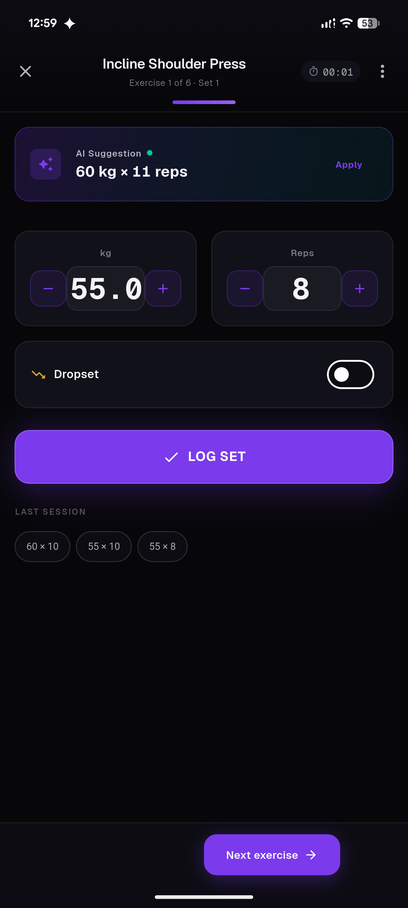
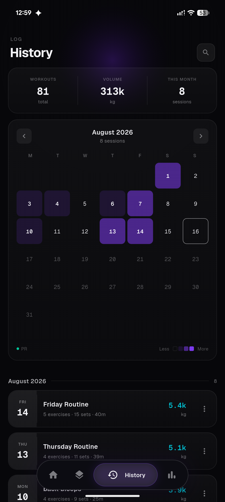
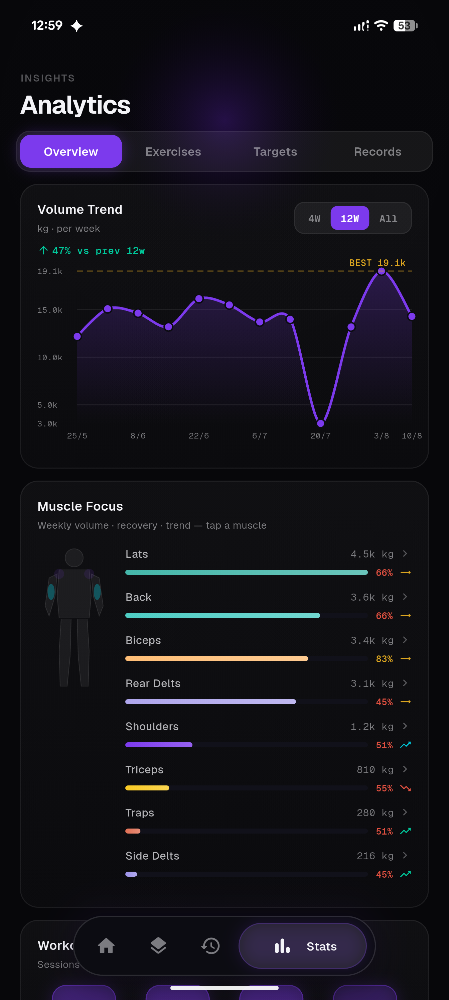
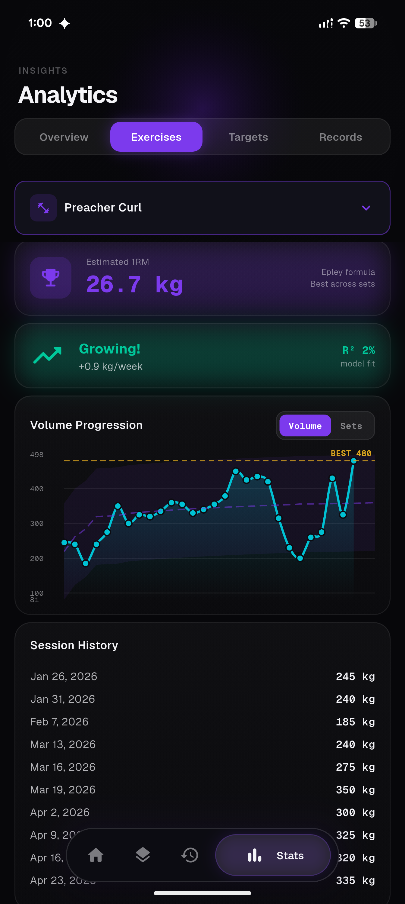
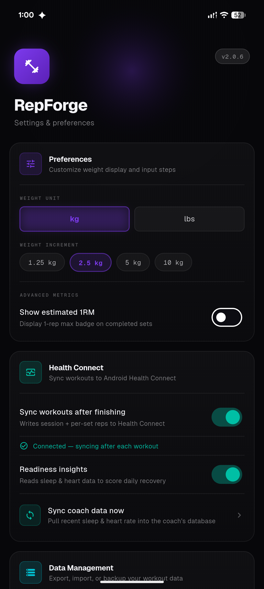
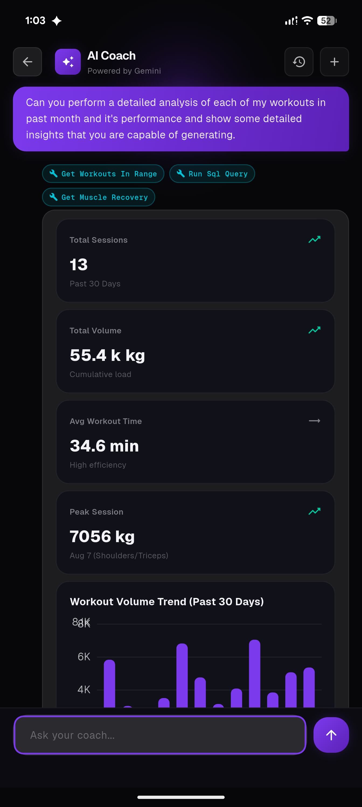
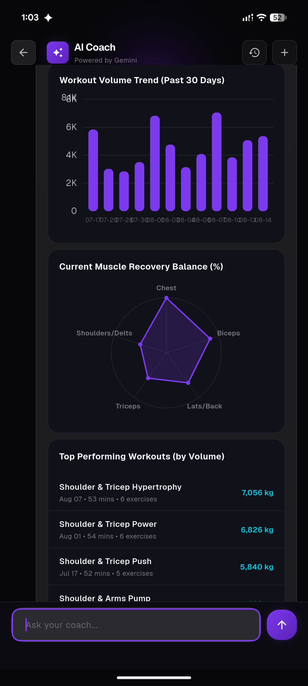

<div align="center">
  <h1>RepForge 🏋️</h1>
  <p>Your ultimate companion to forge strength, track progress, and shatter your fitness goals.</p>

  <!-- Badges -->
  <p>
    <a href="https://flutter.dev/"></a>
    <a href="https://dart.dev/"></a>
    <a href="https://github.com/Devasy/RepForge/stargazers"></a>
    <a href="https://github.com/Devasy/RepForge/network/members"></a>
    <a href="https://github.com/Devasy/RepForge/issues"></a>
    <a href="https://github.com/Devasy/RepForge/blob/main/LICENSE"></a>
  </p>
</div>

---

## 📖 About RepForge

**RepForge** (formerly Workout-logger) is an open-source, beautifully designed workout logging mobile application built with Flutter. Whether you're a powerlifter, a casual gym-goer, or someone just starting their fitness journey, RepForge empowers you to track your workouts seamlessly, visualize your progress with detailed analytics, and stay motivated.

Tired of subscription-heavy fitness apps? RepForge is built *by* lifters, *for* lifters. It keeps your data local, offline, and completely under your control.

## ✨ Key Features

- **📊 Advanced Analytics:** Volume trends, per-exercise progression with estimated 1RM, muscle-group focus and recovery balance, and a full personal-records log — powered by `fl_chart`.
- **⚡ Super-Fast Logging:** An intuitive active-workout flow with AI-suggested weight/reps for your next set, dropsets, and rest timers that gets out of your way so you can focus on the pump.
- **🗓️ Routines & Programs:** Build reusable routines, queue up your next session, and follow structured multi-week training programs.
- **🫀 Health Connect Integration:** Syncs workouts to Android Health Connect and reads sleep/heart-rate data back in to score daily training readiness.
- **🤖 AI Coach:** A conversational, tool-calling coach (powered by Gemini) that can query your own workout history, chart correlations, and explain your progress — see [Anti-Features](#-anti-features) below.
- **📱 Offline-First:** Your data is stored locally for fast, secure access anywhere, even without internet.
- **🔄 Export/Import:** Never lose your data. Back up and restore your workout history at your convenience.
- **🎨 Custom Theming:** A modern, soft-futurist interface with a consistent design system.

## 📸 Screenshots

<p align="center">
  
  
  
  
  
</p>
<p align="center">
  
  
  
  
</p>

## 🚫 Anti-Features

RepForge's core workout logging, routines, and analytics work fully offline. The **AI Coach** is optional and relies on Google's Gemini API over the network — it's the only feature that isn't free/local, and it's disclosed as such in the app's F-Droid listing.

---

## 🚀 Getting Started

Want to take RepForge for a spin or contribute? Follow these steps to build the application on your local machine.

### Prerequisites

- [Flutter SDK](https://docs.flutter.dev/get-started/install)
- Android Studio / VS Code
- An Android device or emulator

### Installation

1. **Clone the repository:**
   ```bash
   git clone https://github.com/Devasy/RepForge.git
   cd RepForge/workout-logger
   ```

2. **Install dependencies:**
   ```bash
   flutter pub get
   ```

3. **Run the app:**
   ```bash
   flutter run
   ```

### Building for Production
To build a release APK for Android:
```bash
flutter build apk --release --split-per-abi
```
The APKs will be available under `build/app/outputs/flutter-apk/`.

### Getting the App

- **GitHub Releases:** [github.com/Devasy/RepForge/releases](https://github.com/Devasy/RepForge/releases)
- **F-Droid:** submission in progress

---

## 🤝 Contributing to RepForge

We believe in the power of open-source! Whether you want to fix a bug, add a feature, or improve documentation, your contributions are highly welcome and appreciated.

### How to Contribute
1. **Fork** the repository and clone it to your local machine.
2. Create a new branch: `git checkout -b feature/your-awesome-feature`.
3. Make your changes and commit them: `git commit -m 'Add some feature'`.
4. Push to the branch: `git push origin feature/your-awesome-feature`.
5. Open a **Pull Request** and describe your changes.

### What to work on?
Check out the **[Issues](https://github.com/Devasy/RepForge/issues)** tab! If you have a new idea, feel free to open a new issue for a feature request or bug report before starting your work. Whether it's a UI tweak, performance upgrade, or a brand new workout mode, we'd love to see it!

### Development Guidelines
- Follow standard Flutter and Dart formatting (`flutter format .`).
- Keep state management clean and modular (we use Provider).
- Ensure your PR doesn't break existing behaviors and try to add tests for new logic (`flutter test`).

---

## 🛡️ License

RepForge is licensed under the [Apache License 2.0](LICENSE).

## 👨‍💻 Developer

**Devasy Patel**
- Email: patel.devasy.23@gmail.com
- GitHub: [@Devasy](https://github.com/Devasy)

---
<div align="center">
  <i>Forge your strength, track your progress, achieve your goals! 💪</i>
</div>
