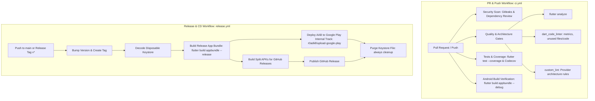

# Automated CI/CD & Google Play Release Workflow

This document details the automated GitHub Actions CI/CD pipelines for **RepForge**, covering PR quality gates, Android dry-run verification, version automation, and continuous delivery of Android App Bundles (`.aab`) to the Google Play Store's **Internal Testing Track**.

---

## 🏗️ Pipeline Architecture

The CI/CD system is split into two specialized workflows:



---

## 1. Continuous Integration (`.github/workflows/ci.yml`)

Triggered on every Pull Request and Push to `main` (and release branches):

1. **`security_scan`**:
   - **Gitleaks**: Scans commits for accidental secret leakage, tokens, or private keys.
   - **Dependency Review**: Blocks PRs introducing vulnerable dependencies or incompatible licenses.
2. **`quality_and_metrics`**:
   - **Flutter Analyzer**: Runs static code analysis across the Dart codebase.
   - **Dart Code Linter (DCL)**: Enforces strict complexity thresholds:
     - Cyclomatic Complexity: `max 20`
     - Maximum Nesting Level: `max 5`
     - Lines of Executable Code: `max 50`
     - Unused Files Detection (`check-unused-files lib`)
     - Dead Code Detection (`check-unused-code lib`)
   - **Architecture Custom Lints (`custom_lint`)**:
     - State-management architecture checks for Provider:
       - `avoid_read_inside_build`: Flags usage of `context.read()` inside `build()` methods to prevent stale widget trees.
       - `avoid_watch_outside_build`: Flags usage of `context.watch()` outside `build()` to prevent uncontrolled rebuild triggers.
3. **`test_and_coverage`**:
   - Runs unit and widget tests (`flutter test --coverage`).
   - Automatically uploads coverage to Codecov.
4. **`android_dry_run`**:
   - Compiles a debug Android App Bundle (`flutter build appbundle --debug`).
   - Verifies Gradle compilation, Android Gradle Plugin (AGP) compatibility, and native C++ JNI builds early in PRs.

---

## 2. Continuous Delivery (`.github/workflows/release.yml`)

Triggered on:
- Merges/pushes to `main`
- Release tags matching `v*` (e.g., `v2.1.2`)
- Manual execution via `workflow_dispatch`

### Release Steps:
1. **Version Bumping**: On push to `main`, `scripts/bump_version.dart patch` automatically increments the patch version in `workout-logger/pubspec.yaml`, creates a commit, and pushes a new Git tag (`vX.Y.Z`).
2. **Automated Build Numbering**: Uses `${{ github.run_number }}` with `flutter build appbundle --release --build-name=${{ steps.version.outputs.value }} --build-number=${{ github.run_number }}`. This ensures monotonically increasing `versionCode` for Google Play.
3. **Disposable Keystore Decoding**: Safely decodes `KEYSTORE_BASE64` to `${{ runner.temp }}/upload-keystore.jks` and cleans it up in a guaranteed `if: always()` step.
4. **Google Play Internal Testing Deployment**: Automatically uploads the signed `.aab` to the **Internal Track** via `r0adkll/upload-google-play@v1`.
5. **GitHub Release Publication**: Builds split release APKs (`arm64-v8a`, `armeabi-v7a`, `x86_64`) and attaches both the APKs and `.aab` bundle to the GitHub release along with automatically generated release notes from merged pull requests.

---

## 🔐 Required GitHub Secrets Configuration

To enable automated release signing and Google Play deployments, configure the following secrets in your GitHub repository:

> Navigation: **GitHub Repository &rarr; Settings &rarr; Secrets and variables &rarr; Actions &rarr; New repository secret**

| Secret Name | Description | Example / Format |
|---|---|---|
| `PLAY_STORE_JSON_KEY` | Google Cloud Service Account JSON key with access to Google Play Developer API | `{ "type": "service_account", "project_id": "...", ... }` |
| `KEYSTORE_BASE64` | Base64-encoded string of your release/upload keystore (`.jks`) | `MIIKogIBAzCCCm8GCSqGSIb3DQEHAaCCCmAEg...` |
| `KEYSTORE_PASSWORD` | Password protecting the keystore file | `YourKeystorePassword123` |
| `KEY_ALIAS` | Alias name of the key pair inside the keystore | `repforge-upload` (or `release`) |
| `KEY_PASSWORD` | Password protecting the private key alias | `YourKeyPassword123` |
| `CODECOV_TOKEN` | *(Optional)* Upload token for Codecov test coverage reports | `UUID string from Codecov dashboard` |

---

## 📋 Step-by-Step Setup Guide

### 1. Generating `KEYSTORE_BASE64`
If you already have a release keystore (`upload-keystore.jks` or `repforge-release.jks`):
```bash
# On Linux / macOS
base64 -w 0 upload-keystore.jks > keystore_base64.txt

# On Windows (PowerShell)
[Convert]::ToBase64String([IO.File]::ReadAllBytes("upload-keystore.jks")) | Out-File -FilePath keystore_base64.txt -NoNewline
```
Copy the entire contents of `keystore_base64.txt` and paste into the `KEYSTORE_BASE64` secret.

### 2. Generating `PLAY_STORE_JSON_KEY` (Google Cloud Service Account)
To allow GitHub Actions to upload to Google Play Console:

1. Open [Google Cloud Console](https://console.cloud.google.com/).
2. Select your Google Play linked GCP project.
3. Enable the **Google Play Android Developer API**.
4. Go to **IAM & Admin &rarr; Service Accounts &rarr; Create Service Account**:
   - Name: `repforge-play-deployer`
   - Role: Not required at the GCP project level (permissions are granted in Play Console).
5. Open the newly created Service Account &rarr; **Keys** tab &rarr; **Add Key** &rarr; **Create new key** &rarr; Select **JSON** &rarr; **Create**.
6. Download the generated `.json` file.
7. Open [Google Play Console](https://play.google.com/console):
   - Go to **Users and permissions** &rarr; **Invite new users**.
   - Enter the service account email (e.g., `repforge-play-deployer@<project>.iam.gserviceaccount.com`).
   - Under **App permissions**, select `com.devasy.repforge`.
   - Under **Account permissions**, grant:
     - **Releases**: *Create, edit, and roll out releases to internal testing tracks*.
     - *View app information and download bulk reports (read-only)*.
   - Click **Invite user** and accept permissions.
8. Paste the entire contents of the downloaded JSON key into the `PLAY_STORE_JSON_KEY` GitHub Secret.

> [!NOTE]
> When uploading your **first** release of a new application, Google Play Console requires the initial `.aab` to be uploaded manually once through the web interface before the API can deploy subsequent releases.

---

## 🛠️ Local Quality Commands

You can run the exact quality suite locally:

```powershell
cd workout-logger

# 1. Custom Lint (Provider state-management architecture rules)
dart run custom_lint

# 2. Dart Code Linter (Metrics & complexity)
dart run dart_code_linter:metrics analyze lib

# 3. Unused files and code detection
dart run dart_code_linter:metrics check-unused-files lib
dart run dart_code_linter:metrics check-unused-code lib

# 4. Tests and Coverage
flutter test --coverage
```
