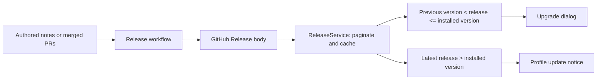
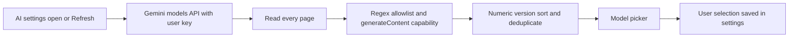

# Dynamic release notes and model discovery

Release notes use GitHub Releases as their public source. The release workflow
publishes authored `docs/releases/<version>.md` when present; otherwise it groups
merged PRs into features, fixes, changes, removed items and known limitations.



The app compares stable numeric versions with the previously seen version saved
in settings. Skipped upgrades aggregate all releases in that interval. Draft and
prerelease entries are ignored. ReleaseService shares in-flight requests and a
six-hour in-memory cache. Failures show a retry action; this is not a persistent
offline cache. Notices link to the release and do not install updates.



The shared parser uses:

```regex
^(?:models/)?(gemini-([0-9]+)\.([0-9]+)-flash(-lite)?)$
```

The complete string must match. Captures provide the canonical model ID, major
version, minor version, and optional Lite variant. Versions sort numerically,
with full Flash before Lite at the same version. Selection changes also validate
the canonical ID before persisting. Discovery additionally requires Google's
`supportedGenerationMethods` to include `generateContent`.

This intentionally excludes Pro, embeddings, Gemma, Imagen, Veo, transcription,
TTS, native audio, Live, image generation, preview, experimental and other
suffixed model names, even if they support `generateContent`. A general-purpose
chat model may still understand audio input; that does not make it a specialized
transcription endpoint. The model list does not advertise every tool/thinking
capability, so those still depend on the app's Gemini request handling.

Refresh preserves the selected model and never automatically switches to the
newest entry. On discovery failure the picker retains its local fallback list.
Future naming conventions require an explicit allowlist change.
