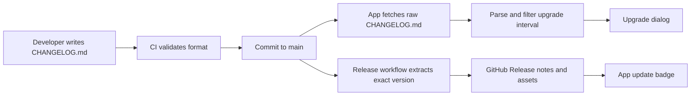
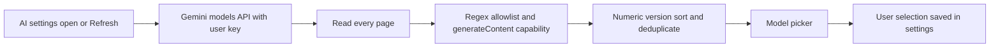

# Dynamic release notes and model discovery

Root `CHANGELOG.md` is the single authored source. See [the format contract](../changelog-format.md).



The app compares numeric versions against the previously seen version saved in
settings. Skipped upgrades aggregate every authored entry in that interval.
Unreleased notes are ignored. Changelog requests share in-flight work and a
six-hour in-memory cache; failures show Retry. Published-release discovery has
its own cache and remains separate, preventing a drafted changelog version from
triggering an update badge before binaries are released. Missing/malformed
changelog entries fail release validation before version commits, tags or deployment.



The shared parser uses:

```regex
^(?:models/)?(gemini-([0-9]+)\.([0-9]+)-flash(-lite)?)$
```

The complete string must match. Captures provide the canonical model ID, major
version, minor version, and optional Lite variant. Versions sort numerically,
with full Flash before Lite at the same version. Selection changes also validate
the canonical ID before persisting. Discovery additionally requires Google's
`supportedGenerationMethods` to include `generateContent`.

This intentionally excludes Pro, embeddings, Gemma, Imagen, Veo, transcription,
TTS, native audio, Live, image generation, preview, experimental and other
suffixed model names, even if they support `generateContent`. A general-purpose
chat model may still understand audio input; that does not make it a specialized
transcription endpoint. The model list does not advertise every tool/thinking
capability, so those still depend on the app's Gemini request handling.

Refresh preserves the selected model and never automatically switches to the
newest entry. On discovery failure the picker retains its local fallback list.
Future naming conventions require an explicit allowlist change.
